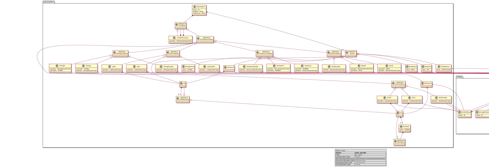

## Description
SmartAutomation (smauto) is a Domain Specific Language (DSL) that enables users to program complex 
automation scenarios, for connected IoT devices, that go beyond simple automation rules. 
The language is built using Python and TextX and follows the model interpretation paradigm.

This repository includes the language definition among with the interpreter.

Furthermore, below you can find useful side-projects, such as a command-line
interface and a server implementation, which exposes a REST API for remote
validation and interpretation of smauto models.

- [smauto-server](https://github.com/robotics-4-all/smauto-server)
- [smauto-cli](https://github.com/robotics-4-all/smauto-cli)


## Installation

This project is delivered as a python package. To install, clone this
repository and install in development mode.

```bash
git clone https://github.com/robotics-4-all/smauto-dsl
cd smauto-dsl
python setup.py develop
```

## SmartAutomation (smauto) Metamodel

The Metamodel of SmAuto DSL can be found [here](assets/images/smauto.png).


The main concepts of the language are:

- Broker
- Entity
- Automation

A SmartAutomation model is composed of `one-or-more` brokers, `*` entities and
`*` automations.

Each one of the main concepts define an internal metamodel. Below are the metamodel
diagrams of each of the Broker, Entity and Automation concepts.





## Write SmartAutomation Models

A SmartAutomation Model contains information about the various devices in
the smart environment (e.g: lights, thermostats, smart fridges etc.),
the way they communicate and all the automated tasks you want them to perform.

The core concepts of smauto metamodel are the Entities, the Brokers and the Automations.

Bellow is a simple example  model in which the air conditioner is turned on according to the
temperature and humidity measurements:

```yaml
mqtt:
    name: home_broker
    host: "localhost"
    port: 1883
    credentials:
        username: "george"
        password: "georgesPassword"

entity:
    name: weather_station
    topic: "porch.weather_station"
    broker: home_broker
    attributes:
        - temperature: float
        - humidity: int
          
entity:
    name: aircondition
    topic: "bedroom.aircondition"
    broker: home_broker
    attributes:
        - temperature: float
        - mode: string
        - on: bool
  
automation:
    name: start_aircondition
    condition: ((weather_station.temperature > 32) AND (weather_station.humidity > 30)) AND (aircondition.on NOT true)
    enabled: true
    continuous: false
    actions:
        - aircondition.temperature:  25.0
        - aircondition.mode:  "cool"
        - aircondition.on:  true

```

For more in-depth description of this example head to the `examples/simple_model`

## Entities

Entities are your connected smart devices that send and receive information
using a message broker. Entities have the following properties:

`a Name, a Broker, a Topic and a set of Attributes.`

Attributes are what define the structure and the type of information in the
messages the Entity sends via the Broker.

You can configure an Entity  using the following syntax:

```yaml
entity:
    name: robot_cleaner
    topic: "bedroom.robot_cleaner"
    broker: upstairs_broker
    attributes:
        - battery: float,
        - cleaning_mode: string,
        - on: bool,
        - destinations: list,
        - location: {
            - x: int,
            - y: int
        }
```


- name: The name for the Entity. Should start with a letter, can contain only
letters, numbers and underscores.
- topic: The Topic in the Broker used by the Entity to send and receive
messages. Note that / should be substituted with .
(e.g: bedroom/aircondition -> bedroom.aircondition).
- broker: The name property of a previously defined Broker which the
Entity uses to communicate.
- attributes: Attributes have a name and a type. As can be seen in the above
example, HA-Auto supports int, float, string, bool, list and dictionary types.
Note that nested dictionaries are also supported.


## Brokers

The Broker acts as the communication layer for messages where each device has
its own Topic which is basically a mailbox for sending and receiving messages.
SmartAutomation DSL supports Brokers which support the MQTT, AMQP and Redis
protocols. You can define a Broker using the syntax in the following example:

```yaml
mqtt:
    name: upstairs_broker
    host: "localhost"
    port: 1883
    credentials:
        username: "my_username"
        password: "my_password"
```

- type: The first line can be mqtt, amqp or redis according to the Broker type
- host: Host IP address or hostname for the Broker
- port: Broker Port number
- vhost: Vhost parameter. Only for AMQP brokers
- exchange: (Optional) Exchange parameter. Only for AMQP brokers.
- credentials:
    - username: Username used for authentication
    - password: Password used for authentication
- db: (Optional) Database number parameter. Only for Redis brokers.


## Automations

Automations allow the execution of a set of actions when a condition is met.
Actions are performed by sending messages to Entities.

You can define an Automation using the syntax in the following example:

```yaml
automation:
    name: start_aircondition
    condition: ((thermometer.temperature > 32) AND (humidity.humidity > 30)) AND (aircondition.on NOT true)
    enabled: true
    continuous: false
    actions:
        - aircondition.temperature:  25.0
        - aircondition.mode:  "cool"
        - aircondition.on:  true
```

- name: The name for the Automation. Should start with a letter, can contain only letters, numbers and underscores.
- condition: The condition used to determine if actions should be run. See Writing Conditions for more information.
- enabled: Whether the Automation should be run or not.
- continuous: Whether the Automation should automatically remain enabled once its actions have been executed.
- actions: The actions that should be run once the condition is met. See Writing Actions for more information.


### Conditions

Conditions are very similar to conditions in imperative programming languages
such as Python, Java, C++ or JavaScript. You can use Entity Attributes in a
condition just like a variable by inserting it in the condition as such:

```
entity_name.attribute_name
```

#### Condition Formatting:

You can combine two conditions into a more complex one using logical operators. A Condition looks like this:

`(condition_1) LOGICAL_OP (condition_2)`

Make sure to not forget the parenthesis.

`condition_1 AND condition_2 AND condition_3`

will have to be rephrased to an equivalent like:

`((condition_1) AND (condition_2)) AND (condition_3)`


#### Lists and Dictionaries:

The language has support for Lists and Dictionaries and even nesting them.
However, for now the use of lists and dictionaries in conditions are treated
as full objects and their individual elements cannot be accessed and used in
conditions. This means that you can compare a List to a full other List, but
cannot compare individual list items. Similarly, you can compare a full
dictionary to another but cannot use individual dictionary items in conditions.

#### Operators

- String Operators: `~`, `!~`, `==`, `!=`
- Numeric Operators: `>`, `<`, `==`, `!=`
- Boolean / Logical Operators: `AND`, `OR`, `NOT`, `XOR`, `NOR`, `XNOR`, `NAND`
- List and Dictionary Operators: `==`, `!=`

#### Example Conditions

Bellow you will find some example conditions.

```
(bedroom_humidity.humidity < 0.3) AND (bedroom_humidifier.state == 0)

((bedroom_human_detector.position != []) AND (bedroom_thermometer.temperature < 27.5)) AND (bedroom_thermostat.state == 0)
```

### Actions

Actions are essentially messages to actuators in your setup such as
air conditioners, lights or speakers. Each action takes a single line and
follows the following format:

```yaml
- entity_name.attribute_name: type
```

Where object can be a string, number, boolean (true/false), list or dictionary.
Actions must be separated by a comma and a change of line (newline).

```yaml
- aircondition.temperature: 25,
- aircondition.mode: "cool",
- aircondition.on: true
```


## Generate Graphs of Automations

A generator is provided which takes a model as input and generates an image
of the automation graph, showing conditions and actions.

Below is the graph of the automation defined in [simple_model example](https://github.com/robotics-4-all/smauto-dsl/tree/main/examples/simple_model)


To generate the graph of automations defined within an smauto model, use the
[smauto-cli](https://github.com/robotics-4-all/smauto-cli) package.

```bash
smauto graph simple_model.smauto
```
