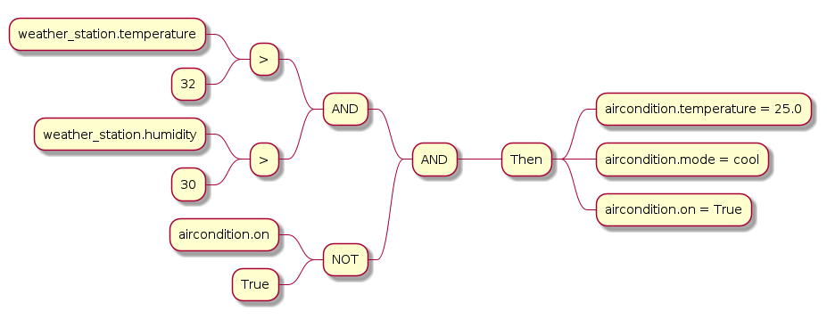

## Description
SmartAutomation (smauto) is a Domain Specific Language (DSL) that enables users to program complex 
automation scenarios, for connected IoT devices, that go beyond simple automation rules. 
The language is built using Python and TextX and follows the model interpretation paradigm.

This repository includes the language definition among with the interpreter.

Furthermore, below you can find useful side-projects, such as a command-line
interface and a server implementation, which exposes a REST API for remote
validation and interpretation of smauto models.

- [smauto-server](https://github.com/robotics-4-all/smauto-server)
- [smauto-cli](https://github.com/robotics-4-all/smauto-cli)


## Installation

This project is delivered as a python package. To install, simply clone this
repository and install using pip.

```bash
git clone https://github.com/robotics-4-all/smauto-dsl
cd smauto-dsl
pip install .
```

## SmartAutomation (smauto) Metamodel

The Metamodel of SmAuto DSL can be found [here](assets/images/smauto.png).


The main concepts of the language are:

- Broker
- Entity
- Automation

A SmartAutomation model is composed of `one-or-more` brokers, `*` entities and
`*` automations.

Each one of the main concepts define an internal metamodel. Below are the metamodel
diagrams of each of the Broker, Entity and Automation concepts.


## Write SmartAutomation Models

A SmartAutomation Model contains information about the various devices in
the smart environment (e.g: lights, thermostats, smart fridges etc.),
the way they communicate and all the automated tasks you want them to perform.

The core concepts of smauto metamodel are the Entities, the Brokers and the Automations.

Bellow is a simple example  model in which the air conditioner is turned on according to the
temperature and humidity measurements:

```yaml
mqtt:
    name: home_broker
    host: "localhost"
    port: 1883
    credentials:
        username: "george"
        password: "georgesPassword"

entity:
    name: weather_station
    topic: "porch.weather_station"
    broker: home_broker
    attributes:
        - temperature: float
        - humidity: int
          
entity:
    name: aircondition
    topic: "bedroom.aircondition"
    broker: home_broker
    attributes:
        - temperature: float
        - mode: string
        - on: bool
  
automation:
    name: start_aircondition
    condition: ((weather_station.temperature > 32) AND (weather_station.humidity > 30)) AND (aircondition.on NOT true)
    enabled: true
    continuous: false
    actions:
        - aircondition.temperature:  25.0
        - aircondition.mode:  "cool"
        - aircondition.on:  true

```

For more in-depth description of this example head to the `examples/simple_model`

### Conditions

Conditions are very similar to conditions in imperative programming languages
such as Python, Java, C++ or JavaScript. You can use Entity Attributes in a
condition just like a variable by inserting it in the condition as such:

```
entity_name.attribute_name
```

#### Condition Formatting:

You can combine two conditions into a more complex one using logical operators. A Condition looks like this:

`(condition_1) LOGICAL_OP (condition_2)`

Make sure to not forget the parenthesis.

`condition_1 AND condition_2 AND condition_3`

will have to be rephrased to an equivalent like:

`((condition_1) AND (condition_2)) AND (condition_3)`


#### Lists and Dictionaries:

The language has support for Lists and Dictionaries and even nesting them.
However, for now the use of lists and dictionaries in conditions are treated
as full objects and their individual elements cannot be accessed and used in
conditions. This means that you can compare a List to a full other List, but
cannot compare individual list items. Similarly, you can compare a full
dictionary to another but cannot use individual dictionary items in conditions.

#### Operators

- String Operators: `~`, `!~`, `==`, `!=`
- Numeric Operators: `>`, `<`, `==`, `!=`
- Boolean / Logical Operators: `AND`, `OR`, `NOT`, `XOR`, `NOR`, `XNOR`, `NAND`
- List and Dictionary Operators: `==`, `!=`

#### Example Conditions

Bellow you will find some example conditions. You can find more by visiting
the examples folder in the HA-Auto repository here.

```
(bedroom_humidity.humidity < 0.3) AND (bedroom_humidifier.state == 0)

((bedroom_human_detector.position != []) AND (bedroom_thermometer.temperature < 27.5)) AND (bedroom_thermostat.state == 0)
```


### Actions

Actions are essentially messages to actuators in your setup such as
air conditioners, lights or speakers. Each action takes a single line and
follows the following format:

```yaml
- entity_name.attribute_name: type
```

Where object can be a string, number, boolean (true/false), list or dictionary.
Actions must be separated by a comma and a change of line (newline).

```yaml
- aircondition.temperature: 25,
- aircondition.mode: "cool",
- aircondition.on: true
```


## Generate Graphs of Automations

A generator is provided which takes a model as input and generates an image
of the automation graph, showing conditions and actions.

Below is the graph of the automation defined in 



To generate the graph of automations defined within an smauto model, use
[smauto-cli](https://github.com/robotics-4-all/smauto-cli).

```bash
smauto gen-automation-graph simple_model.smauto
```
