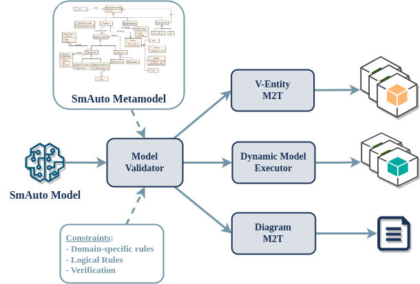
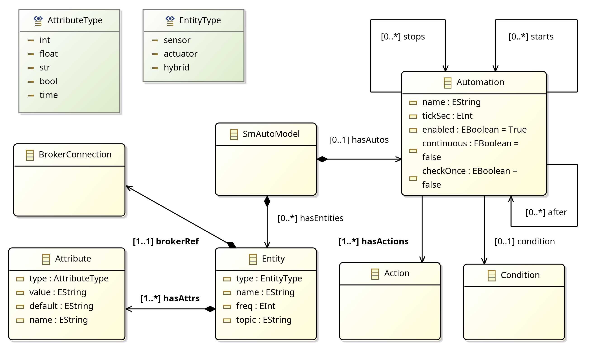
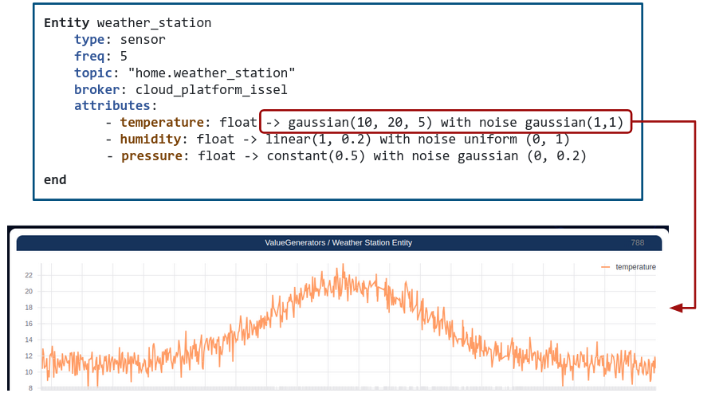
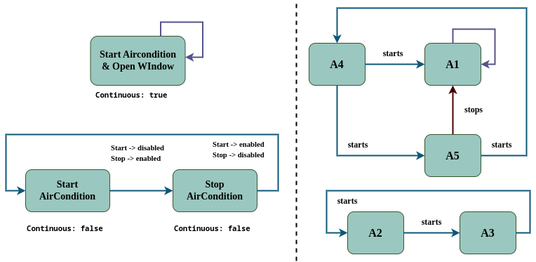
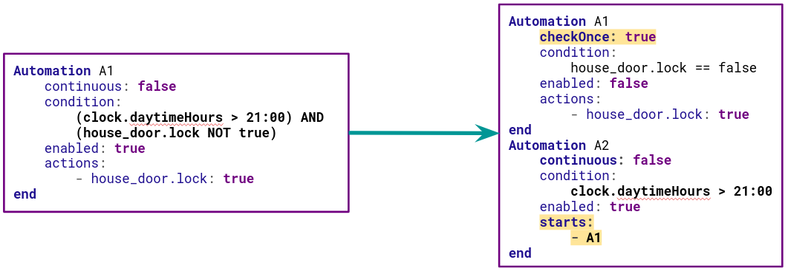
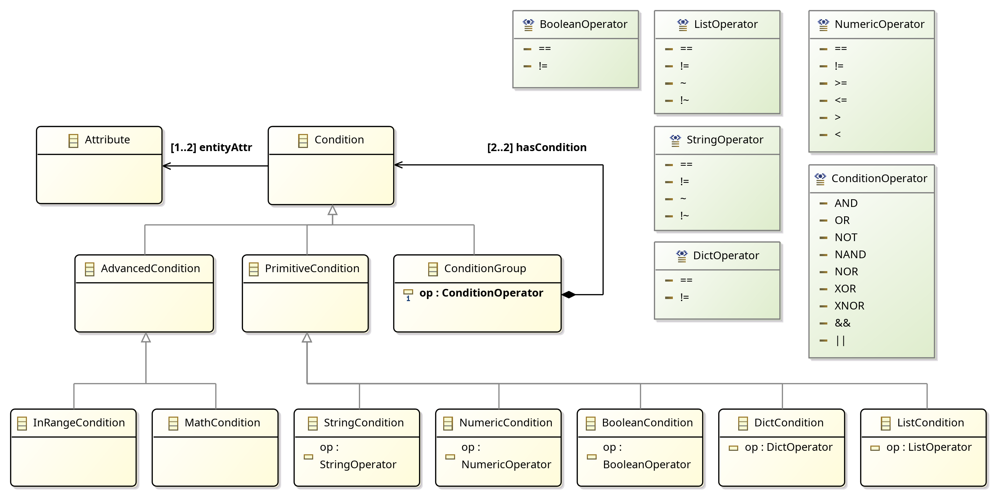

# SmAuto DSL


## Description
Smart environments are becoming quite popular in the home setting consisting of a broad range of connected devices. While offering a novel set of possibilities, this also contributes to the complexity of the environment, posing new challenges to allowing the full potential of a sensorized home to be made available to users.

SmAuto is a Domain Specific Language (DSL) that enables users to program complex 
automation scenarios, for connected IoT devices in smart environments,
that go beyond simple tasks. 


The DSL is developed using Python and TextX and includes a meta-model and a grammar, that is
specialized for smart environments, while it also provides the following features:

- **Command-line Interface**. Used to call the validator and the 
code generators explicitely.
- **REST Api**. The DSL implements a REST API, that can be utilized to remotely call
the validator and the code generators on demand. Also usefull for
integrating the language in bigger projects and cloud-based platforms.
- **Generate Virtual Entities**. A code generator is provided that transforms
Entity model definitions into executable code with enhanced value generation with
optional noise functions applied on. This can be very usefull to automatically
generate the source code of virtual entities which simulate the behaviour of physical
sensors.
- **Compile Models**. Models are transformed (Model-to-Text) into executable Python source code implementing the Automations logic.
- **Generate Visualization graphs of Automations**. A generator is provided 
which takes a model as input and generates an image
of the automation graph.



## Installation

### Source Installation

This project is delivered as a python package. To install, simply clone this
repository and install using pip.

```bash
git clone https://github.com/robotics-4-all/smauto-dsl
cd smauto-dsl
pip install .
```

### Docker image

SmAuto can be build into a standalone docker image and provides a REST API
for remotely performing model validation, automated
generation of automations and virtual entities.

To build the image execute from this directory:

```
docker build -t smauto .
```

then run the container with:

```
docker run -it --rm --name mysmauto -p 8080:8080 smauto
```

By default the image exposes port 8080 for the REST API.

## SmAuto Overview

The Root Metamodel of the DSL is evident below.



The main concepts of the language are:

- **Broker**
- **Entity**
- **Automation**
- **Condition**
- **Action**

An SmAuto model is composed of `one-or-more` brokers, `*` entities and
`*` automations.

Each one of the main concepts define an internal metamodel.
An SmAuto Model contains information about the various devices in
the smart environment (e.g: lights, thermostats, smart fridges etc.),
the way they communicate and the automation tasks.

Bellow is a simple example  model in which the air conditioner is turned on according to the
temperature and humidity measurements:

```
Broker<MQTT> home_broker
    host: "localhost"
    port: 1883
    auth:
        username: ""
        password: ""
end

Entity weather_station
    type: sensor
    topic: "porch.weather_station"
    broker: home_broker
    attributes:
        - temperature: float
        - humidity: int
end

Entity aircondition
    type: actuator
    topic: "bedroom.aircondition"
    broker: home_broker
    attributes:
        - temperature: float
        - mode: str
        - on: bool
end

Automation start_aircondition
    condition:
        (weather_station.temperature > 32) AND
        (aircondition.on is true)
    enabled: true
    continuous: false
    actions:
        - aircondition.temperature:  25.0
        - aircondition.mode:  "cool"
        - aircondition.on:  true
end
```

For more in-depth description of this example head to the `examples/simple_model`

### Entities

Entities are your connected smart devices that send and receive information
using a message broker. Entities have the following required properties:

- A unique name
- A broker to connect to
- A topic to send/receive messages
- A set of attributes

**Attributes** are what define the structure and the type of information in the
messages the Entity sends to the communication broker.

Entity definitions follow the syntax of the below examples, for both sensor and actuator types. The difference between the two is that sensors are considered "Producers" while actuators are "Consumers" in the environment. Sensor Entities have an extra property, that is the `freq` to set the publishing frequency of either physical or virtual.

```
Entity weather_station
    type: sensor
    freq: 5
    topic: "bedroom.weather_station"
    broker: cloud_broker
    attributes:
        - temperature: float
        - humidity: float
        - pressure: float
end
```

```
Entity bedroom_lamp
    type: actuator
    topic: "bedroom.lamp"
    broker: cloud_platform_issel
    attributes:
        - power: bool
end
```

- **type**: The Entity type. Currently supports `sensor`, `actuator` or `hybrid`
- **topic**: The Topic in the Broker used by the Entity to send and receive
messages. Note that / should be substituted with .
(e.g: bedroom/aircondition -> bedroom.aircondition).
- **broker**: The name property of a previously defined Broker which the
Entity uses to communicate.
- **attributes**: Attributes have a name and a type. As can be seen in the above
example, HA-Auto supports int, float, string, bool, list and dictionary types.
Note that nested dictionaries are also supported.
- **description (Optional)**: A description of the Entity
- **freq (Optional)**: Used for Entities of type "**sensor**" to set the msg publishing rate

Notice that each Entity has it's own reference to a Broker, thus the metamodel
allows for communicating with Entities which are connected to different message
brokers. This allows for definining automation for multi-broker architectures.

Supported data types for Attributes:

- **int**: Integer numerical values
- **float**: Floating point numerical values
- **bool**: Boolean (true/false) values
- **str**: String values
- **time**: Time values (e.g. `01:25`)
- **list**: List / Array
- **dict**: Dictionary

#### Attribute value generation for virtual Entities

SmAuto provides a code generator which can be utilized to transform Entities models
into executable source code in Python.
This feature of the language enables end-to-end generation of the objects (sensors, actuators, robots)
which send and receive data based on their models. Thus it can be used to 
generate while virtual smart environments and directly dig into defining and
testing automations.

For this purpose, the language supports (Optional) definition of a `Value Generator` and a `Noise` to be applied on each attribute of an Entity of type **sensor** separately.

```
Entity weather_station
    type: sensor
    freq: 5
    topic: "smauto.bme"
    broker: home_mqtt_broker
    attributes:
        - temperature: float -> gaussian(10, 20, 5) with noise gaussian(1,1)
        - humidity: float -> linear(1, 0.2) with noise uniform (0, 1)
        - pressure: float -> constant(0.5)
end
```

The above example utilizes this feature of the language. Each attribute can define
it's own value and noise generators, using a simple grammar as evident below:

```
-> <ValueGenerator> with noise <NoiseGenerator>
```

**Supported Value Generators:**

- **Constant**: `constant(value)`. Constant value
- **Linear**: `linear(min, step)`. Linear function
- **Saw**: `saw(min, max, step)`. Saw function.
- **Gaussian**: `gaussian(value, maxValue, sigma)`. Gaussian function
- **Replay**: `replay([values], times)`. Replay from a list of values. The `times` parameter can be used to force replay iterations to a specific value. If `times=-1` then values will be replayed infinitely.
- **ReplayFile**: `replayFile("FILE_PATH")`. Replay data from a file.


**Supported Noise Generators:**

- **Uniform**: `uniform(min, max)`.
- **Gaussian**: `gaussian(mean, sigma)`.

Value generation and Noise are optional in the language and are features used
by the Virtual Entity generator to transform Entity models into executable code.



### Brokers

The Broker acts as the communication layer for messages where each device has
its own Topic which is basically a mailbox for sending and receiving messages.
SmartAutomation DSL supports Brokers which support the MQTT, AMQP and Redis
protocols. You can define a Broker using the syntax in the following example:

```
Broker<MQTT> upstairs_broker
    host: "localhost"
    port: 1883
    auth:
        username: "my_username"
        password: "my_password"
end
```

- **type**: The first line can be `MQTT`, `AMQP` or `Redis` according to the Broker type
- **host**: Host IP address or hostname for the Broker
- **port**: Broker Port number
- **auth**: Authentication credentials. Unified for all communication brokers.
    - **username**: Username used for authentication
    - **password**: Password used for authentication
- **vhost (Optional)**: Vhost parameter. Only for AMQP brokers
- **vhost (Optional)**: Vhost parameter. Only for AMQP brokers
- **topicExchange (Optional)**: (Optional) Exchange parameter. Only for AMQP brokers.
- **rpcExchange (FUTURE SUPPORT)**: Exchange parameter. Only for AMQP brokers.
- **db (Optional)**: Database number parameter. Only for Redis brokers.

### Automations

Automations allow the execution of a set of actions when a condition is met.
Actions are performed by sending messages to Entities.



You can define an Automation using the syntax in the following example:

```
Automation start_aircondition
    condition: 
        (
            (thermometer.temperature > 32) AND 
            (humidity.humidity > 30)
        ) AND (aircondition.on == true)
    enabled: true
    continuous: false
    actions:
        - aircondition.temperature:  25.0
        - aircondition.mode:  "cool"
        - aircondition.on:  true
end

Automation start_humidifier
    condition:
        bedroom_humidity_sensor.humidity > 0.6
    enabled: true
    actions:
        - bedroom_humidifier.power: true
        - bedroom_humidifier.timer: -1
    starts:
        - stop_humidifier
end

Automation stop_humidifier
    condition:
        bedroom_humidity_sensor.humidity < 0.3
    enabled: false
    actions:
        - bedroom_humidifier.power: false
    starts:
        - start_humidifier
end
```

- **condition**: The condition used to determine if actions should be run.
- **enabled**: Whether the Automation should be run or not.
- **continuous**: Whether the Automation should automatically remain enabled once its actions have been executed.
- **checkOnce**: The condition of the automation will run **ONLY ONCE** and
  exit.
- **actions**: The actions that should be run once the condition is met. See Writing Actions for more information.
- **after**: The automation will not start
    and will be hold at the IDLE state until termination of the automations
    listed here as dependencies.
- **starts**: Starts other automation after termination of the current
  automation.
- **stops**: stops other automation after termination of the current
  automation.




### Conditions

Conditions are very similar to conditions in imperative programming languages
such as Python, Java, C++ or JavaScript. You can use Entity Attributes in a
condition just like a variable by referencing it in the Condition using 
it's Fully-Qualified Name (FQN) in dot (.) notation.

```
entity_name.attribute_name
```



Below is an example of a Condition that references several attributes of
more-than-one Entities.

```
Entity corridor_temperature
    type: sensor
    topic: "corridor.temperature"
    broker: home_mqtt_broker
    freq: 10
    attributes:
        - temperature: float
end

Entity kitchen_temperature
    type: sensor
    topic: "kitchen.temperature"
    broker: home_mqtt_broker
    freq: 10
    attributes:
        - temperature: float
end

Entity aircondition
    type: actuator
    topic: "bedroom.aircondition"
    broker: home_broker
    attributes:
        - temperature: float
        - mode: str
        - on: bool
end

Automation start_aircondition
    condition:
        (corridor_temperature.temperature > 30) AND
        (kitchen_temperature.temperature > 30)
    actions:
        - aircondition.temperature:  25.0
        - aircondition.mode:  "cool"
        - aircondition.power:  true
        - window.state:  1
end
```

#### Condition Formatting:

You can combine two conditions into a more complex one using logical operators.
The general format of the Condition is:

`(condition_1) LOGICAL_OP (condition_2)`

Make sure to not forget the parenthesis.

`condition_1 AND condition_2 AND condition_3`

will have to be rephrased to an equivalent like:

`((condition_1) AND (condition_2)) AND (condition_3)`


#### Lists and Dictionaries:

The language has support for Lists and Dictionaries and even nesting them.
However, for now the use of lists and dictionaries in conditions are treated
as full objects and their individual elements cannot be accessed and used in
conditions. This means that you can compare a List to a full other List, but
cannot compare individual list items. Similarly, you can compare a full
dictionary to another but cannot use individual dictionary items in conditions.

Nested in-language reference to Dict and List items will be supported in a future release
of the language.

#### Operators

- String Operators: `~`, `!~`, `==`, `!=`, `has`
- Numeric Operators: `>`, `>=`, `<`, `<=`, `==`, `!=`
- Logical Operators: `AND`, `OR`, `NOT`, `XOR`, `NOR`, `XNOR`, `NAND`
- BooleanValueOperator: `is` , `is not`;
- List and Dictionary Operators: `==`, `!=`

#### Build-in attribute processing functions

The language provides buildi-in functions which can be applied to attribute references
when defining a Condition.

```
condition:
    (mean(bedroom_temp_sensor.temperature, 10) > 28) AND
    (std(bedroom_temp_sensor.temperature, 10) > 1)

condition:
    bedroom_humidity_sensor.humidity in range(30, 60)

condition:
    bedroom_temp_sensor.temperature in range(24, 26) AND
    bedroom_humidity_sensor.humidity in range(30, 60)

condition:
    var(mean(bedroom_temp_sensor.temperature, 10), 10) >= 0.1
```


**Supported Functions:**

- **mean**: The mean of the attribute buffer
- **std**: The standard deviation of the attribute buffer
- **var**: The variance of the attribute buffer
- **min**: The minimum value in the attribute buffer
- **max**: The maximum value in the attribute buffer

#### Writing Conditions

Bellow you will find some example conditions.

```
(bedroom_humidity.humidity < 0.3) AND (bedroom_humidifier.state == 0)

((bedroom_human_detector.position != []) AND 
    (bedroom_thermometer.temperature < 27.5)
) AND (bedroom_thermostat.state == 0)
```

### Actions

Actions are essentially messages to actuators in your setup such as
air conditioners, lights or speakers. Each action takes a single line and
has the following format:

```yaml
- entity_name.attribute_name: value
```

Where object can be a string, number, boolean (true/false), list or dictionary.

```yaml
- aircondition.temperature: 25
- aircondition.mode: "cool"
- aircondition.power: true
```

### Metadata

An SmAuto model can use the **Metadata** concept of the language to define meta-information as below

```
Metadata
    name: SimpleHomeAutomation
    version: "0.1.0"
    description: "Simple home automation model."
    author: "klpanagi"
    email: "klpanagi@gmail.com"
end
```

The properties of the **Metadata** concept are:
- **name**: The name of the model
- **description**: The standard deviation of the attribute buffer
- **author**: The variance of the attribute buffer
- **email**: The minimum value in the attribute buffer
- **extraAttr: (UNDER DEVELOPMENT)**: Include user-defined attributes/properties which can be used by M2M and M2T transformations and custom scripts.


### RTMonitor

RTMonitor is used to define the monitoring parameters of an SmAuto runtime. Compiled Automations are handled by an executor that is also configured to feed runtime information, such as logs and events (automation-related states etc).

```
RTMonitor
    broker: default_broker
    namespace: "smauto.simple_home_auto"
    eventTopic: "event"
    logsTopic: "logs"
end
```

The properties of **RTMonitor** are:
- **broker**: Reference to a Broker definition
- **namespace**: A namespace used for constructing the URIs (prefix)
- **eventsTopic**: Topic to send events
- **logsTopic**: Topic to send logs
- **extraAttr: (UNDER DEVELOPMENT)**: Include user-defined attributes/properties which can be used by M2M and M2T transformations and custom scripts.


## Constraints

The language includes constraints applied to models after initialization.
These constraints refer to domain-specific logical rules.

```
Value and Noise Generators can only be applied to Entities of type "sensor" or 
"robot".

```

```
Actions can only refer Attributes of "actuator" and "robot" Entities.
```

```
Only "actuator" and "robot" Attributes can have default values.
```

```
The freq property can only be set only for sensor and robot Entities.
```

## Command-Line-Interface

```bash
➜ smauto --help         
Usage: smauto [OPTIONS] COMMAND [ARGS]...

Options:
  --help  Show this message and exit.

Commands:
  gen        Generate in Python
  genv       Entities to Code - Generate executable virtual entities
  graph      Graph generator - Generate automation visualization graphs
  validate   Model Validation
```


### Compile Virtual Entities

To compile SmAuto Entity models into Virtual Entities as explained above, use either the CLI or the REST API of the DSL. Furhermore, the compiler (code generator) can be configured to either generate a single Python executable for each Entity definition, or compile into a merged executable (use the `--merged/-m` flag) that includes all VEntities.

```bash
venv [I] ➜ smauto genv model.auto
[CLI] Compiled virtual Entity: system_clock.py
[CLI] Compiled virtual Entity: bedroom_lamp.py
[CLI] Compiled virtual Entity: motion_detector.py
```

```bash
venv [I] ➜ smauto genv -m model.auto
[CLI] Compiled virtual Entities: simplehomeautomation_entities.py
```

## Compile Automations


To compile SmAuto models into executable Python programs which run the Automations, use either the CLI or the REST API of the DSL.

```bash
venv [I] ➜ smauto gen model.auto
[CLI] Compiled Automations: SimpleHomeAutomation.py
```

## Generate Graphs of Automations (Under Development)

The CLI provides a command for generating visualization graphs of input models. Generated graphs are used for the evaluation of conditions and actions of the defined automation, before performing model execution. The automated creation of graph images is performed in two steps; initially, a M2M transformation is performed on the input SmAuto model and the output is a PlantUML model in textual format. Afterwards, an M2T transformation takes place to transform the PlantUML model into the output diagram
