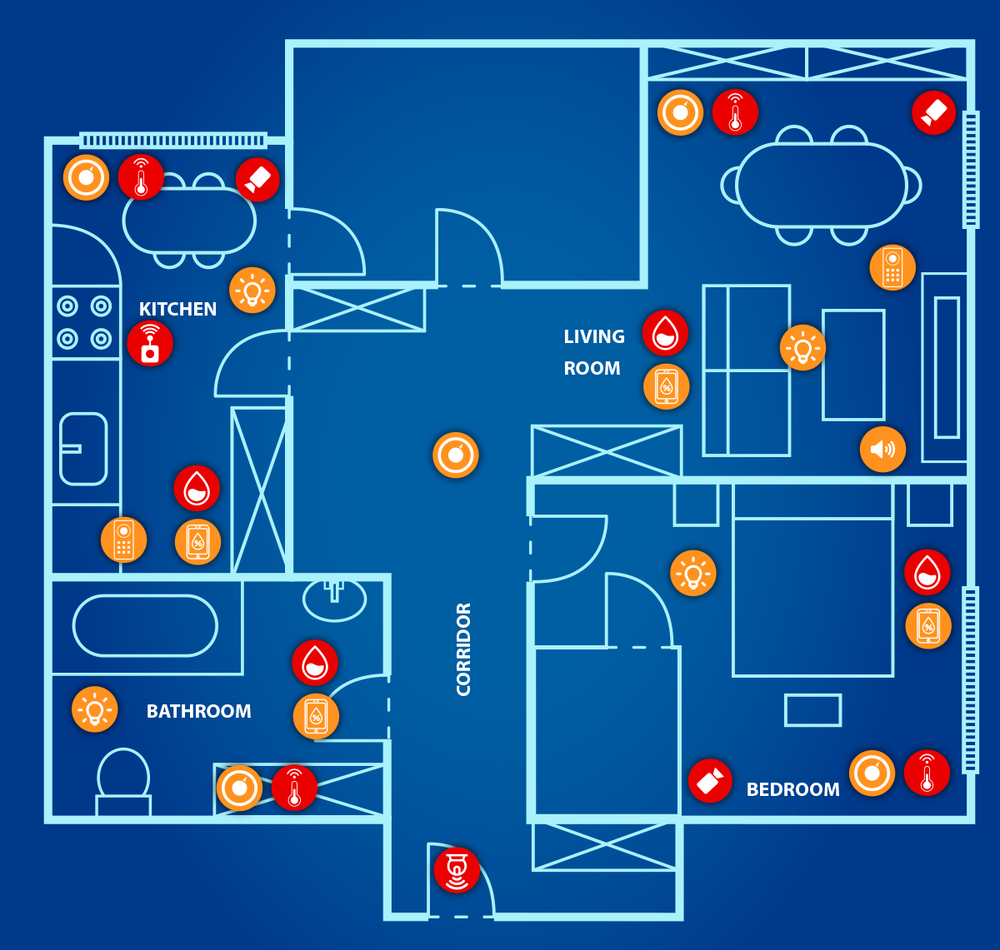
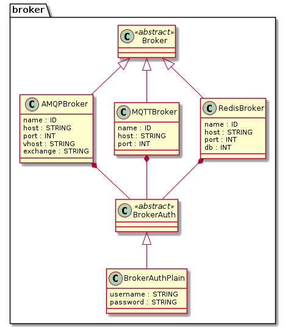
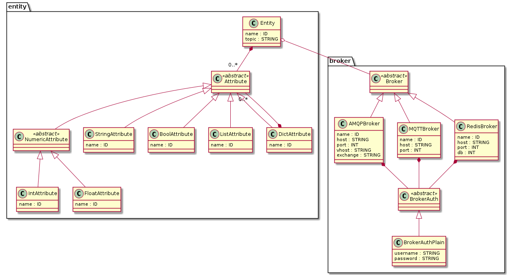

# SmAuto DSL


## Description
Smart environments are becoming quite popular in the home setting consisting of a broad range of connected devices. While offering a novel set of possibilities, this also contributes to the complexity of the environment, posing new challenges to allowing the full potential of a sensorized home to be made available to users.

SmAuto is a Domain Specific Language (DSL) that enables users to program complex 
automation scenarios, for connected IoT devices in smart environments,
that go beyond simple tasks. 




The DSL is developed using Python and TextX and follows the model interpretation
and executable models paradigms. It includes a meta-model and a grammar, that is
specialized for smart environments, while it also provides the following features:

- **Command-line Interface**. Used to call the validator, the interpreter and the 
code generator explicitely.
- **REST Api**. The DSL implements a REST Api, that can be utilized to remotely call
the validator, the interpreter and the code generator on demand. ALso usefull for
integrating the language in bigger projects and cloud-based platforms.
- **Dynamically compile and execute models**. Model classes are constructed at runtime
and are enhanced with platform-specific code that implements the logic. This process is
executed by the language interpreter.
- **Generate Virtual Entities**. A code generator is provided that transforms
Entity model definitions into executable code with enhanced value generation with
optional noise functions applied on. This can be very usefull to automatically
generate the source code of virtual entities which simulate the behaviour of physical
sensors.
- **Generate Visualization graphs of Automations**. A generator is provided 
which takes a model as input and generates an image
of the automation graph.

## Installation

### Source Installation

This project is delivered as a python package. To install, simply clone this
repository and install using pip.

```bash
git clone https://github.com/robotics-4-all/smauto-dsl
cd smauto-dsl
pip install .
```

### Docker image

SmAuto can be build into a standalone docker image and provides a REST API
for remotely performing model validation, interpretation and automated
generation of virtual entities.

To build the image execute from this directory:

```
docker build -t smauto .
```

then run the container with:

```
docker run -it --rm --name mysmauto -p 8080:8080 smauto
```

By default the image exposes port 8080 for the REST API.

## SmAuto Overview

The Metamodel of SmAuto DSL can be found [here](assets/images/smauto.png).

The main concepts of the language are:

- Broker
- Entity
- Automation
- Condition
- Action

An SmAuto model is composed of `one-or-more` brokers, `*` entities and
`*` automations.

Each one of the main concepts define an internal metamodel. Below are the metamodel
diagrams of each of the Broker, Entity and Automation concepts.






An SmAuto Model contains information about the various devices in
the smart environment (e.g: lights, thermostats, smart fridges etc.),
the way they communicate and the automation tasks.

Bellow is a simple example  model in which the air conditioner is turned on according to the
temperature and humidity measurements:

```yaml
MQTT:
    name: home_broker
    host: "localhost"
    port: 1883
    credentials:
        username: "george"
        password: "georgesPassword"

Entity:
    name: weather_station
    topic: "porch.weather_station"
    broker: home_broker
    attributes:
        - temperature: float
        - humidity: int
          
Entity:
    name: aircondition
    topic: "bedroom.aircondition"
    broker: home_broker
    attributes:
        - temperature: float
        - mode: string
        - on: bool
  
Automation:
    name: start_aircondition
    condition:
        (weather_station.temperature > 32) AND 
        (aircondition.on NOT true)
    enabled: true
    continuous: false
    actions:
        - aircondition.temperature:  25.0
        - aircondition.mode:  "cool"
        - aircondition.on:  true
```

For more in-depth description of this example head to the `examples/simple_model`

### Entities

Entities are your connected smart devices that send and receive information
using a message broker. Entities have the following required properties:

- A unique name
- A broker to connect to
- A topic to send/receive messages
- A set of attributes

**Attributes** are what define the structure and the type of information in the
messages the Entity sends to the communication broker.

You can configure an Entity  using the following syntax:

```yaml
Entity:
    name: robot_cleaner
    type: robot
    topic: "bedroom.robot_cleaner"
    broker: upstairs_broker
    attributes:
        - battery: float
        - cleaning_mode: string
        - on: bool
        - destinations: list
        - location: dict = {
            x: int,
            y: int
        }
```


- **name**: The name for the Entity. Should start with a letter, can contain only
letters, numbers and underscores.
- **topic**: The Topic in the Broker used by the Entity to send and receive
messages. Note that / should be substituted with .
(e.g: bedroom/aircondition -> bedroom.aircondition).
- **broker**: The name property of a previously defined Broker which the
Entity uses to communicate.
- **attributes**: Attributes have a name and a type. As can be seen in the above
example, HA-Auto supports int, float, string, bool, list and dictionary types.
Note that nested dictionaries are also supported.

Notice that each Entity has it's own reference to a Broker, thus the metamodel
allows for communicating with Entities which are connected to different message
brokers. This allows for definining automation for multi-broker architectures.

Supported data types for Attributes:

- int: Integer numerical values
- float: Floating point numerical values
- bool: Boolean (true/false) values
- str: String values
- list: List / Array
- dict: Dictionary

#### Attribute value generation for virtual Entities

SmAuto provides a code generator which can be utilized to transform Entities models
into executable source code in Python.
This feature of the language enables end-to-end generation of the objects (sensors, actuators, robots)
which send and receive data based on their models. Thus it can be used to 
generate while virtual smart environments and directly dig into defining and
testing automations.

For this purpose, the language supports (Optional) definition of a `Value Generator` and a `Noise` to be applied on each attribute of an Entity of type **sensor** separately.

```yaml
Entity:
    name: weather_station
    type: sensor
    freq: 5
    topic: "smauto.bme"
    broker: home_mqtt_broker
    attributes:
        - temperature: float -> gaussian(10, 20, 5) with noise gaussian(1,1)
        - humidity: float -> linear(1, 0.2) with noise uniform (0, 1)
        - pressure: float -> constant(0.5)
```

The above example utilizes this feature of the language. Each attribute can define
it's own value and noise generators, using a simple grammar as evident below:

```
-> <ValueGenerator> with noise <NoiseGenerator>
```

**Supported Value Generators:**

- **Constant**: `constant(value)`.
- **Linear**: `linear(min, step)`.
- **Gaussian**: `gaussian(value, maxValue, sigma)`.


**Supported Noise Generators:**

- **Uniform**: `uniform(min, max)`.
- **Gaussian**: `gaussian(mean, sigma)`.

Value generation and Noise are optional in the language and are features used
by the Virtual Entity generator to transform Entity models into executable code.

### Brokers

The Broker acts as the communication layer for messages where each device has
its own Topic which is basically a mailbox for sending and receiving messages.
SmartAutomation DSL supports Brokers which support the MQTT, AMQP and Redis
protocols. You can define a Broker using the syntax in the following example:

```yaml
MQTT:
    name: upstairs_broker
    host: "localhost"
    port: 1883
    credentials:
        username: "my_username"
        password: "my_password"
```

- **type**: The first line can be `MQTT`, `AMQP` or `Redis` according to the Broker type
- **host**: Host IP address or hostname for the Broker
- **port**: Broker Port number
- **vhost**: Vhost parameter. Only for AMQP brokers
- **exchange**: (Optional) Exchange parameter. Only for AMQP brokers.
- **credentials**:
    - **username**: Username used for authentication
    - **password**: Password used for authentication
- **db**: (Optional) Database number parameter. Only for Redis brokers.


### Automations

Automations allow the execution of a set of actions when a condition is met.
Actions are performed by sending messages to Entities.

You can define an Automation using the syntax in the following example:

```yaml
Automation:
    name: start_aircondition
    condition: 
        (
            (thermometer.temperature > 32) AND 
            (humidity.humidity > 30)
        ) AND (aircondition.on NOT true)
    enabled: true
    continuous: false
    actions:
        - aircondition.temperature:  25.0
        - aircondition.mode:  "cool"
        - aircondition.on:  true

Automation:
    name: start_humidifier
    condition:
        bedroom_humidity_sensor.humidity > 0.6
    enabled: true
    actions:
        - bedroom_humidifier.power: true
        - bedroom_humidifier.timer: -1
    starts:
        - stop_humidifier

Automation:
    name: stop_humidifier
    condition:
        bedroom_humidity_sensor.humidity < 0.3
    enabled: false
    actions:
        - bedroom_humidifier.power: false
    starts:
        - start_humidifier
```

- **name**: The name for the Automation. Should start with a letter, can contain only letters, numbers and underscores.
- **condition**: The condition used to determine if actions should be run. See **Writing Conditions** for more information.
- **enabled**: Whether the Automation should be run or not.
- **continuous**: Whether the Automation should automatically remain enabled once its actions have been executed.
- **checkOnce**: The condition of the automation will run **ONLY ONCE** and
  exit.
- **actions**: The actions that should be run once the condition is met. See Writing Actions for more information.
- **after**: The automation will not start
    and will be hold at the IDLE state until termination of the automations
    listed here as dependencies.
- **starts**: Starts other automation after termination of the current
  automation.
- **stops**: stops other automation after termination of the current
  automation.


### Conditions

Conditions are very similar to conditions in imperative programming languages
such as Python, Java, C++ or JavaScript. You can use Entity Attributes in a
condition just like a variable by referencing it in the Condition using 
it's Fully-Qualified Name (FQN) in dot (.) notation.

```
entity_name.attribute_name
```

Below is an example of a Condition that references several attributes of
more-than-one Entities.

```yaml
Entity:
    name: corridor_temperature
    type: sensor
    topic: "corridor.temperature"
    broker: home_mqtt_broker
    freq: 10
    attributes:
        - temperature: float

Entity:
    name: kitchen_temperature
    type: sensor
    topic: "kitchen.temperature"
    broker: home_mqtt_broker
    freq: 10
    attributes:
        - temperature: float

Automation:
    name: start_aircondition
    condition:
        (corridor.temperature > 30) AND
        (kitchen.temperature > 30)
    actions:
        - aircondition.temperature:  25.0
        - aircondition.mode:  "cool"
        - aircondition.power:  true
        - window.state:  1
```

#### Condition Formatting:

You can combine two conditions into a more complex one using logical operators.
The general format of the Condition is:

`(condition_1) LOGICAL_OP (condition_2)`

Make sure to not forget the parenthesis.

`condition_1 AND condition_2 AND condition_3`

will have to be rephrased to an equivalent like:

`((condition_1) AND (condition_2)) AND (condition_3)`


#### Lists and Dictionaries:

The language has support for Lists and Dictionaries and even nesting them.
However, for now the use of lists and dictionaries in conditions are treated
as full objects and their individual elements cannot be accessed and used in
conditions. This means that you can compare a List to a full other List, but
cannot compare individual list items. Similarly, you can compare a full
dictionary to another but cannot use individual dictionary items in conditions.

Nested in-language reference to Dict and List items will be supported in a future release
of the language.

#### Operators

- String Operators: `~`, `!~`, `==`, `!=`
- Numeric Operators: `>`, `<`, `==`, `!=`
- Logical Operators: `AND`, `OR`, `NOT`, `XOR`, `NOR`, `XNOR`, `NAND`
- BooleanValueOperator: '==' , '!=' , 'is' , 'is not';
- List and Dictionary Operators: `==`, `!=`

#### Build-in attribute processing functions

The language provides buildi-in functions which can be applied to attribute references
when defining a Condition.

```yml
condition:
    (mean(weather_station.temperature, 10) > 28) AND
    (std(weather_station.temperature, 10) > 1)

```

#### Writing Conditions

Bellow you will find some example conditions.

```
(bedroom_humidity.humidity < 0.3) AND (bedroom_humidifier.state == 0)

((bedroom_human_detector.position != []) AND (bedroom_thermometer.temperature < 27.5)) AND (bedroom_thermostat.state == 0)
```

### Actions

Actions are essentially messages to actuators in your setup such as
air conditioners, lights or speakers. Each action takes a single line and
follows the following format:

```yaml
- entity_name.attribute_name: value
```

Where object can be a string, number, boolean (true/false), list or dictionary.

```yaml
- aircondition.temperature: 25
- aircondition.mode: "cool"
- aircondition.power: true
```

## Constraints

The language includes constraints applied to models after initialization.
These constraints refer to domain-specific logical rules.

```
Value and Noise Generators can only be applied to Entities of type "sensor" or 
"robot".

```

```
Actions can only refer Attributes of "actuator" and "robot" Entities.
```

```
Only "actuator" and "robot" Attributes can have default values.
```

```
The freq property can only be set only for sensor and robot Entities.
```

## Dynamic Model Execution


SmAuto implements a language interpreter, to parse and validate the model against the meta-model and the logical rules, and to execute the input model. The interpreter dynamically constructs the classes (in Python) in-memory and executes the automation tasks described by the input model, using the Python interpreter. For this purpose, a command-line interface is provided to work with validation and dynamic execution of models, as long as for generating a visual graph for each automation (image file). Of course, for the graph generation and model execution processes, the validation process is initially executed and are terminated in case of syntactic and logical errors in the input model.

To execute the automations defined within an SmAuto (.smauto) model use the CLI.

```bash
smauto interpret simple_model.smauto
```

## Generate Virtual Entities

The executor process takes as input the model, after success validation, and initially constructs the classes in-memory. The next step is to augment the model classes with platform-specific code, that includes the following core functionalities:

- Augment the Entity class, to connect entities to the message broker and create relevant interfaces (publisher or subscriber), depending on it's type (Sense or Act). The Entity class monitors the state of the smart object by subscribing to the relevant topic and creates a local mirror of it's state. In case of actuator entities (Entity Act), it also constructs a publisher to send commands when actions are triggered by the automation. This augmentation implements the communication layer.
- Transform the condition of each automation, expressed in SmAuto, into Python source code, that actually implements a lambda function. The injected lambda function is called at each "tick" of the executor.
- Augment the Automation class and include platform-specific code that implements the execution logic. Each Automation has an internal state machine that defines four (4) states and the transitions as it appears in Figure \ref{XX}.
\end{itemize}

To generate the virtual versions of entities defined within an smauto model, use the CLI.

```bash
smauto generate simple_model.smauto
```

## Generate Graphs of Automations

The CLI provides a command for generating visualization graphs of input models. Generated graphs are used for the evaluation of conditions and actions of the defined automation, before performing model execution. The automated creation of graph images is performed in two steps; initially, a M2M transformation is performed on the input SmAuto model and the output is a PlantUML model in textual format. Afterwards, an M2T transformation takes place to transform the PlantUML model into the final image (see Figure \ref{fig:automation_graph}). The M2M transforms conditions into a graph, where the left-most leaf nodes include entity attributes and values, while the right-most leaf nodes represent the properties of actions, which are the entity to perform the action on and it's state (attribute values). Finally, intermediate nodes in the graph represent the operators of the condition.

Below is the graph of the automation defined in [simple_model example](https://github.com/robotics-4-all/smauto-dsl/tree/main/examples/simple_model)


To generate the graph of automations defined within an smauto model, use the CLI.

```bash
smauto graph simple_model.smauto
```
