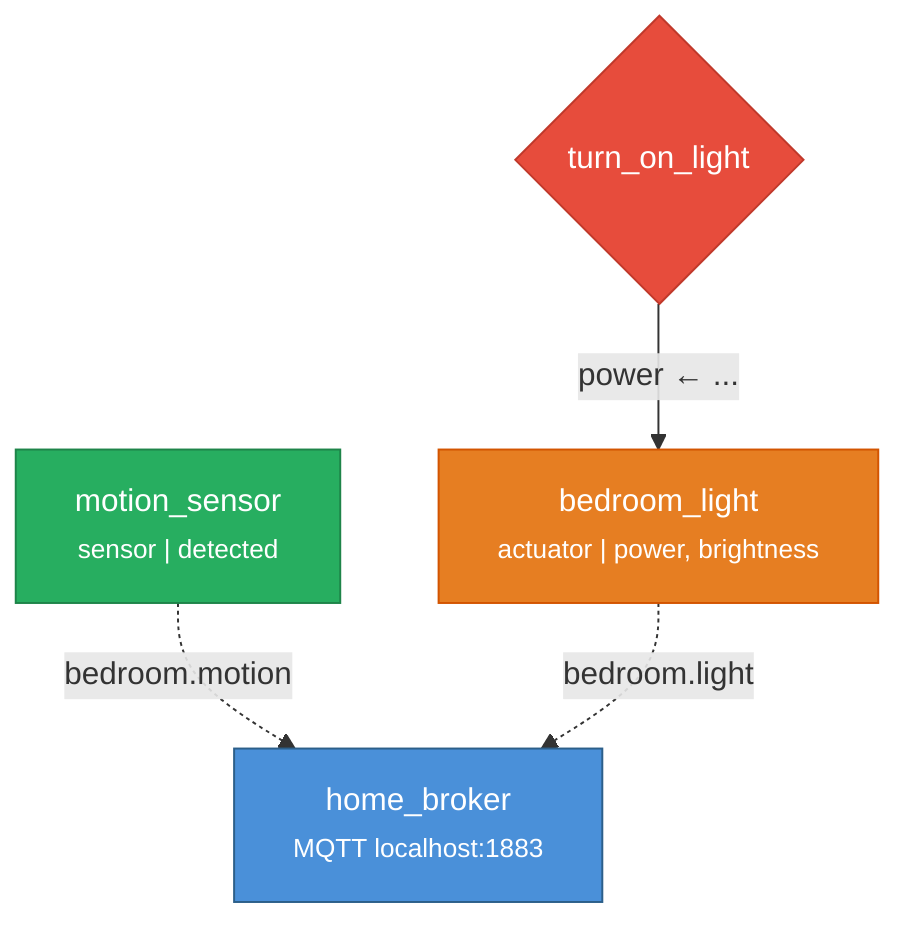

A Domain-Specific Language for programming IoT automation scenarios in smart environments.

## Table of Contents

- [Overview](#overview)
- [Architecture](#architecture)
- [Installation](#installation)
- [Quick Start](#quick-start)
- [Language Overview](#language-overview)
- [Conditions](#conditions)
- [Actions](#actions)
- [Automation Configuration](#automation-configuration)
- [Automation Status and Coordination](#automation-status-and-coordination)
- [Aggregate Functions](#aggregate-functions)
- [Value Generators and Noise](#value-generators-and-noise)
- [CLI Reference](#cli-reference)
- [Model Visualization](#model-visualization)
- [Examples](#examples)
- [Docker and Deployment](#docker-and-deployment)
- [Documentation](#documentation)
- [License](#license)

## Overview

SmAuto lets you define IoT automations as declarative models instead of hand-writing event loops, message handlers, and state machines. You describe *what* should happen and *when*, and SmAuto compiles your model into executable Python.

The language follows the **ECA (Event-Condition-Action)** formalism. Each automation watches for a condition on entity attributes, then fires a set of actions when that condition holds. Built with Python and [textX](https://textx.github.io/textX/), SmAuto parses `.auto` model files into a typed metamodel and generates code through Jinja2 templates.

Key capabilities:

- Declarative ECA automations with conditions over entity attributes, time, and automation status
- Multi-protocol support: MQTT, AMQP, Redis brokers and REST endpoints
- Inter-automation coordination via `triggers`, `terminates`, and status-based conditions
- Virtual entity generation with configurable value generators and noise functions
- Sliding-window aggregate functions (mean, std, var, min, max)
- Else branches, cooldown timers, time-range conditions, and expression-based actions
- Model visualization as Mermaid diagrams
- Compile-time semantic validation (type checks, unique names, constraint enforcement)

## Architecture


The pipeline works in four stages:

1. **Parse** . The `.auto` model file is parsed by the textX-generated parser against the SmAuto grammar.
2. **Metamodel** . textX builds a typed object graph from the parse tree, with custom Python classes for each DSL concept.
3. **Validate** . Semantic checks run over the model: unique names, type constraints, generator/noise applicability, action targets.
4. **Generate** . Jinja2 templates transform the validated model into executable Python code (automations and/or virtual entities).

## Installation

Requires Python 3.11 or later.

```bash
git clone https://github.com/robotics-4-all/smauto
cd smauto
pip install .
```

For development:

```bash
pip install -e ".[dev,test]"
```

## Quick Start

Create a file called `model.auto` with a motion-activated bedroom light:

```
Metadata
    name: SmartLight
    version: "0.1.0"
    description: "Motion-activated bedroom light."
    author: "smauto"
    email: "smauto@2023"
end

Broker<MQTT> home_broker
    host: "localhost"
    port: 1883
    auth:
        username: ""
        password: ""
end

Entity motion_sensor
    type: sensor
    freq: 2
    uri: "bedroom.motion"
    source: home_broker
    attributes:
        - detected: bool -> replay([false, false, true, true, false], -1)
end

Entity bedroom_light
    type: actuator
    uri: "bedroom.light"
    source: home_broker
    attributes:
        - power: bool
        - brightness: int = 0
end

Automation turn_on_light
    when
        motion_sensor.detected is true
    then
        bedroom_light.power <- true
        bedroom_light.brightness <- 100
    config
        continuous: true
end
```

Validate and compile:

```bash
smauto validate model.auto       # Check for errors
smauto gen model.auto             # Compile to executable Python
smauto genv model.auto            # Generate virtual entities
```

## Language Overview

| Concept | Syntax | Description |
|---------|--------|-------------|
| Metadata | `Metadata ... end` | Optional model metadata (name, version, author) |
| Broker (MQTT) | `Broker<MQTT> name ... end` | MQTT message broker connection |
| Broker (AMQP) | `Broker<AMQP> name ... end` | AMQP broker with SSL, vhost, topic exchange |
| Broker (Redis) | `Broker<Redis> name ... end` | Redis broker with database selection |
| RESTEndpoint | `RESTEndpoint name ... end` | HTTP API source (GET/POST/PUT/DELETE) |
| Entity | `Entity name ... end` | Connected device: `sensor`, `actuator`, or `hybrid` |
| Attributes | `- name: type` | Typed fields: `int`, `float`, `bool`, `str`, `time`, `list`, `dict` |
| Default values | `- name: type = value` | Defaults for actuator/hybrid attributes |
| Value generators | `-> generator(...)` | Simulated data for sensor/hybrid attributes |
| Noise | `with noise func(...)` | Random noise layered on generators |
| Automation | `Automation name ... end` | ECA rule: `when` condition `then` actions |
| Conditions | `entity.attr op value` | Numeric, string, boolean, time, status, in-range |
| Actions | `entity.attr <- value` | Set actuator/hybrid attribute values |
| Expression actions | `entity.attr <- expr(...)` | Computed values referencing other entity attributes |
| Else block | `else ... ` | Fallback actions when condition is false |
| triggers | `triggers auto1, auto2` | Enable listed automations after success |
| terminates | `terminates auto1, auto2` | Disable and terminate listed automations |

## Conditions

### Condition Types

| Type | Syntax Example | Description |
|------|----------------|-------------|
| Numeric | `sensor.temperature > 32` | Compare numeric attributes |
| String | `device.mode == "cool"` | String equality, pattern matching |
| Boolean | `sensor.detected is true` | Boolean state check |
| Time | `system_clock.time >= 22:00` | Compare against `HH:MM` time values |
| TimeRange | `system_clock.time in range [08:00, 18:00]` | Check if time falls within a range (supports midnight wrap) |
| Status | `auto_name.status == SUCCESS` | Check another automation's execution status |
| InRange | `sensor.humidity in range [30, 60]` | Check if numeric value is within bounds |

### Operators

| Category | Operators |
|----------|-----------|
| Numeric | `>`, `>=`, `<`, `<=`, `==`, `!=` |
| String | `~`, `!~`, `==`, `!=`, `has`, `in`, `not in` |
| Boolean | `is`, `is not` |
| Time | `>`, `>=`, `<`, `<=`, `==`, `!=` |
| Status | `==`, `!=` |
| Logical | `AND`, `OR`, `NOT`, `XOR`, `NOR`, `XNOR`, `NAND` |

### Compound Conditions

Combine conditions with logical operators. Wrap each sub-condition in parentheses:

```
when
    (weather_station.temperature > 32) AND
    (weather_station.humidity > 60)
```

Nesting works as expected:

```
when
    ((motion_sensor.detected is true) OR
     (door_sensor.open is true)) AND
    (arm_system.status == SUCCESS)
```

## Actions

Actions assign values to actuator or hybrid entity attributes using the `<-` operator. Each action goes on its own line inside the `then` block.

```
then
    aircondition.temperature <- 25.0
    aircondition.mode <- "cool"
    aircondition.on <- true
```

### Expression Actions

The `expr()` syntax lets you compute values from other entity attributes at runtime:

```
then
    hvac_unit.setpoint <- expr(outdoor_sensor.temperature + 5)
```

The expression inside `expr()` can reference any entity attribute in the model. Actions can only target attributes belonging to `actuator` or `hybrid` entities.

## Automation Configuration

### Config Properties

| Property | Type | Default | Description |
|----------|------|---------|-------------|
| `enabled` | bool | `true` | Whether the automation evaluates its condition |
| `continuous` | bool | `false` | Keep evaluating after actions execute (loop) |
| `checkOnce` | bool | `false` | Evaluate once, then stop regardless of outcome |
| `freq` | int | - | Evaluation frequency in Hz |
| `delay` | int | - | Seconds to wait before executing actions (debounce) |
| `cooldown` | int | - | Minimum seconds between consecutive action executions |
| `description` | str | - | Human-readable description |

### Else Block

The `else` block defines fallback actions that execute when the condition is *not* met. Useful for toggle-style automations:

```
Automation comfort_control
    when
        temperature_sensor.temperature > 26
    then
        hvac_unit.power <- true
        hvac_unit.mode <- "cooling"
    else
        hvac_unit.mode <- "idle"
        hvac_unit.fan_speed <- 30
    config
        continuous: true
        cooldown: 60
end
```

### Triggers and Terminates

**`triggers`** enables listed automations (sets `enabled = true`) after the current automation's actions execute successfully. **`terminates`** disables listed automations and sets their status to `TERMINATED`.

```
Automation start_humidifier
    when
        humidity_sensor.humidity > 0.6
    then
        humidifier.power <- true
    triggers
        stop_humidifier
end

Automation stop_humidifier
    when
        humidity_sensor.humidity < 0.3
    then
        humidifier.power <- false
    config
        enabled: false
    triggers
        start_humidifier
end
```

## Automation Status and Coordination

Every automation tracks its execution status. You can reference this status in other automations' conditions to build multi-stage pipelines.

### Status Values

| Status | Meaning |
|--------|---------|
| `IDLE` | Not yet started or waiting to re-evaluate |
| `RUNNING` | Condition is being evaluated |
| `SUCCESS` | Condition met, actions executed successfully |
| `FAILED` | Error during evaluation or action execution |
| `FINISHED` | Actions completed |
| `TERMINATED` | Disabled by another automation via `terminates` |

### Status Conditions

Use `automation_name.status == STATUS` or `!= STATUS` in `when` blocks:

```
when
    run_diagnostics.status == SUCCESS
```

### Coordination Example

From the home security example: `arm_system` runs at night and triggers `detect_intrusion`. The intrusion detector only fires when the system has been armed successfully:

```
Automation arm_system
    when
        system_clock.time >= 22:00
    then
        smart_lock.locked <- true
    config
        continuous: true
    triggers
        detect_intrusion
end

Automation detect_intrusion
    when
        (arm_system.status == SUCCESS) AND
        ((motion_sensor.detected is true) OR
         (door_sensor.open is true))
    then
        alarm_siren.active <- true
        alarm_siren.volume <- 100
    config
        enabled: false
        checkOnce: true
end
```

## Aggregate Functions

Sliding-window aggregate functions operate on the last N values of a numeric attribute.

| Function | Syntax | Description |
|----------|--------|-------------|
| `mean` | `mean(entity.attr, window)` | Mean of last N values |
| `std` | `std(entity.attr, window)` | Standard deviation |
| `var` | `var(entity.attr, window)` | Variance |
| `min` | `min(entity.attr, window)` | Minimum value |
| `max` | `max(entity.attr, window)` | Maximum value |

Functions are composable and can appear in compound conditions:

```
when
    (mean(temperature_probe.temperature, 10) > 80) AND
    (std(vibration_sensor.amplitude, 20) > 1.5)
```

## Value Generators and Noise

Sensor and hybrid entities can attach value generators (and optional noise) to attributes for virtual entity simulation.

### Generators

| Generator | Syntax | Description |
|-----------|--------|-------------|
| Constant | `constant(value)` | Fixed value |
| Linear | `linear(start, step)` | Linear increment |
| Saw | `saw(min, max, step)` | Sawtooth wave |
| Sinus | `sinus(value, amplitude, step)` | Sinusoidal wave |
| Gaussian | `gaussian(value, maxValue, sigma)` | Gaussian distribution |
| Replay | `replay([v1, v2, ...], times)` | Replay a value list (`times=-1` for infinite loop) |
| ReplayFile | `replayFile("path")` | Replay values from a file |

### Noise Functions

| Noise | Syntax | Description |
|-------|--------|-------------|
| Uniform | `uniform(min, max)` | Uniform random noise |
| Gaussian | `gaussian(mean, sigma)` | Gaussian random noise |

### Example

```
Entity temperature_sensor
    type: sensor
    freq: 5
    uri: "office.temperature"
    source: office_broker
    attributes:
        - temperature: float -> gaussian(22, 35, 5) with noise gaussian(0, 0.3)
        - humidity: float -> saw(30, 70, 1) with noise uniform(-2, 2)
end
```

Generators and noise can only be applied to `sensor` and `hybrid` entities.

## CLI Reference

| Command | Description | Example |
|---------|-------------|---------|
| `smauto validate <model>` | Parse and validate a `.auto` model | `smauto validate model.auto` |
| `smauto gen <model>` | Compile automations to executable Python | `smauto gen model.auto` |
| `smauto genv <model>` | Generate virtual entities (one file per entity) | `smauto genv model.auto` |
| `smauto genv -m <model>` | Generate virtual entities (merged into one file) | `smauto genv -m model.auto` |
| `smauto graph <model>` | Generate a Mermaid diagram of model relationships | `smauto graph model.auto` |
| `smauto graph -o <file>` | Write the Mermaid diagram to a file | `smauto graph model.auto -o diagram.md` |

## Model Visualization

The `smauto graph` command produces a Mermaid flowchart showing brokers, entities, automations, and the connections between them.

```bash
smauto graph model.auto
```

Sample output:


```mermaid
graph TD
    classDef broker fill:#4a90d9,stroke:#2c5f8a,color:#fff
    classDef sensor fill:#27ae60,stroke:#1e8449,color:#fff
    classDef actuator fill:#e67e22,stroke:#d35400,color:#fff
    classDef automation fill:#e74c3c,stroke:#c0392b,color:#fff

    home_broker["home_broker<br/><small>MQTT localhost:1883</small>"]
    class home_broker broker

    motion_sensor["motion_sensor<br/><small>sensor | detected</small>"]
    class motion_sensor sensor
    motion_sensor -.->|bedroom.motion| home_broker

    bedroom_light["bedroom_light<br/><small>actuator | power, brightness</small>"]
    class bedroom_light actuator
    bedroom_light -.->|bedroom.light| home_broker

    turn_on_light{turn_on_light}
    class turn_on_light automation
    turn_on_light -->|power ← ...| bedroom_light
```

The diagram shows entity-to-broker connections (via URI), automation-to-entity action edges, `triggers` edges (bold arrows), and `terminates` edges (dashed arrows).

## Examples

The `examples/` directory contains nine progressive scenarios, each demonstrating different language features:

| # | Name | Description | Key Features |
|---|------|-------------|--------------|
| 01 | Smart Light | Motion-activated bedroom light | Basic automation, boolean conditions, replay generator |
| 02 | Smart Thermostat | Temperature-controlled HVAC | Numeric conditions, trigger toggle pattern |
| 03 | Home Security | Time-based arming, intrusion detection | Time conditions, status conditions, triggers/terminates |
| 04 | Smart Greenhouse | Climate control with generators | All generator types, in-range conditions, delay |
| 05 | Industrial Monitoring | Factory floor across three protocols | Multi-protocol (MQTT+AMQP+Redis), aggregate functions |
| 06 | Smart Building | Multi-zone building management | Multi-zone coordination, peak shaving, fire safety |
| 07 | Startup Sequence | Multi-stage factory pipeline | Status-only conditions, sequential staging, error handling |
| 08 | Energy Management | Solar/battery/grid optimization | Mixed status + entity conditions, multi-source |
| 09 | Smart HVAC | Office climate with advanced features | Else branches, cooldown, time ranges, expression actions |

Browse the full models at [`examples/`](examples/).

## Docker and Deployment

SmAuto ships with Docker support and a [tx-lsp](https://github.com/robotics-4-all/tx-lsp) integration for LSP and REST API access.

```bash
make build                           # Build the Docker image
make up                              # Start services (API :8080, LSP :2087)
make up API_KEY=mysecret             # Start with API key authentication
make down                            # Stop services
```

See the [Deployment Guide](docs/deployment.md) for REST API usage, configuration options, and production setup.

## Documentation

- [Language Reference](docs/language-reference.md) . Complete syntax for brokers, entities, automations, conditions, actions, and generators.
- [Deployment Guide](docs/deployment.md) . Docker setup, REST API, Makefile targets.
- [Formal Semantics](smauto/grammar/README.md) . Abstract syntax, type system, and operational semantics.
- [Examples](examples/) . Nine progressive IoT automation scenarios.

## License

MIT
