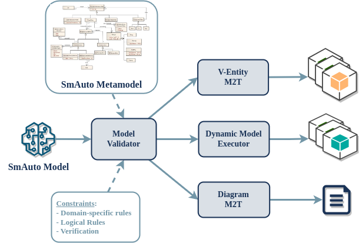

# SmAuto DSL


A Domain-Specific Language for programming IoT automation scenarios in smart environments. Built with Python and [textX](https://textx.github.io/textX/).



## Features

- **ECA Automations** — Event-Condition-Action rules with `triggers`, `terminates`, and status-based coordination
- **Multi-Protocol Brokers** — MQTT, AMQP, and Redis
- **Virtual Entity Generation** — Generate executable sensor simulators with configurable value and noise generators
- **Model Compilation** — Compile `.auto` models into executable Python
- **CLI** — Validate, compile, and generate from the command line

## Installation

```bash
git clone https://github.com/robotics-4-all/smauto-dsl
cd smauto-dsl
pip install .
```

## Quick Example

```
Broker<MQTT> home_broker
    host: "localhost"
    port: 1883
    auth:
        username: ""
        password: ""
end

Entity motion_sensor
    type: sensor
    freq: 2
    topic: "bedroom.motion"
    broker: home_broker
    attributes:
        - detected: bool -> replay([false, false, true, true, false], -1)
end

Entity bedroom_light
    type: actuator
    topic: "bedroom.light"
    broker: home_broker
    attributes:
        - power: bool
        - brightness: int = 0
end

Automation turn_on_light
    when
        motion_sensor.detected is true
    then
        bedroom_light.power <- true
        bedroom_light.brightness <- 100
    config
        continuous: true
end
```

## Automation Coordination

Automations track execution status (`IDLE`, `RUNNING`, `SUCCESS`, `FAILED`, `FINISHED`, `TERMINATED`), enabling inter-automation coordination:

```
Automation arm_system
    when
        system_clock.time >= 22:00
    then
        smart_lock.locked <- true
    config
        continuous: true
    triggers
        detect_intrusion
end

Automation detect_intrusion
    when
        (arm_system.status == SUCCESS) AND
        (motion_sensor.detected is true)
    then
        alarm.active <- true
    config
        enabled: false
end
```

See [`examples/`](examples/) for 8 progressive real-world scenarios.

## CLI

```bash
smauto validate model.auto          # Validate a model
smauto gen model.auto               # Compile automations to Python
smauto genv model.auto              # Generate virtual entities (per-entity)
smauto genv -m model.auto           # Generate virtual entities (merged)
```

## Docker

Ships with [tx-lsp](https://github.com/robotics-4-all/tx-lsp) for LSP and REST API support.

```bash
make build                           # Build image
make up                              # Start (API :8080, LSP :2087)
make up API_KEY=mysecret             # With authentication
make down                            # Stop
```

See [Deployment Guide](docs/deployment.md) for REST API usage and configuration.

## Documentation

- [Language Reference](docs/language-reference.md) — Brokers, Entities, Automations, Conditions, Actions, Value Generators
- [Deployment Guide](docs/deployment.md) — Docker, REST API, Makefile targets
- [Formal Semantics](smauto/grammar/README.md) — Abstract syntax, type system, operational semantics
- [Examples](examples/) — 8 progressive IoT automation scenarios
